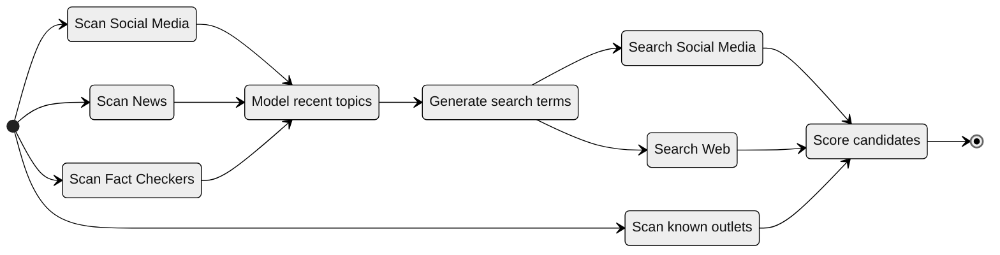
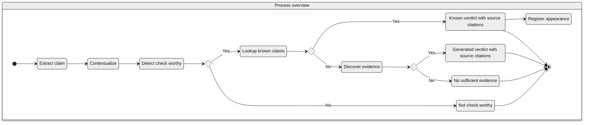
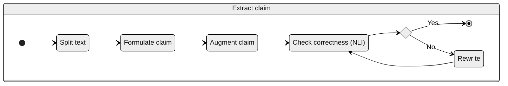
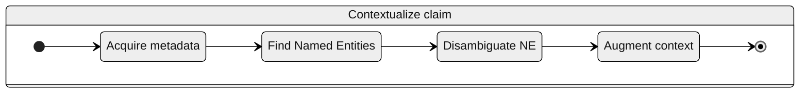
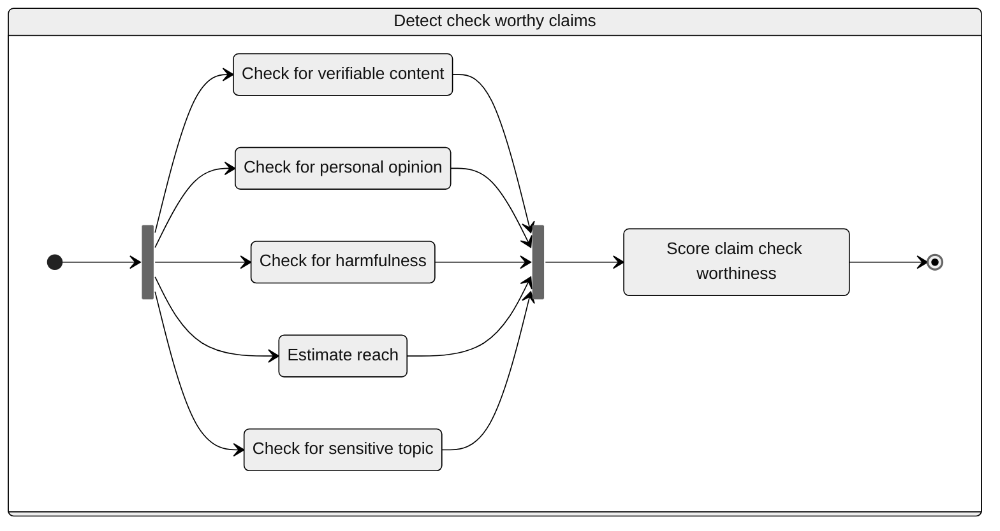
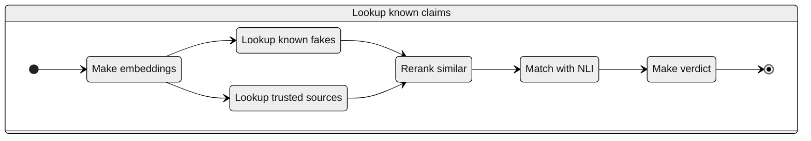

# Fact check
Required processes:
- **Media scan**: fast and robust selection process to identify items to be checked
- **Fact check**: multiphase verification protocol

## Media scan

## Fact check process 
### Overview

### Extract claim

### Contextualize claim

### Detect check worthy claims

### Lookup known high-quality sources

### Discover evidence and rate claim

```mermaid
stateDiagram
  direction TB
%%{init: {'theme':'neutral'}}%%
%%% 
evidence_find: Find evidence
%%%
decompose_claim: Decompose claim
search_decomposed: Recursive search for decomposed claim element
generate_search_terms: Generate search terms
search_web: Search Web
extract_source_claims: Extract source claims
match_source_nli: Match sources with NLI
partial_verdict_from_evidence: Determine partial verdict
final_verdict_from_evidence: Determine final verdict
lookup_source_reputation: Lookup source reputation
writeup_debunk: Write-up debunk
%%%
state evidence_find {
  [*] --> decompose_claim 
  decompose_claim --> search_decomposed
  direction LR
    state search_decomposed {
      direction LR

    [*] --> generate_search_terms
    generate_search_terms --> search_web
    search_web --> lookup_source_reputation
    search_web --> extract_source_claims
    extract_source_claims --> match_source_nli
    match_source_nli --> partial_verdict_from_evidence
    lookup_source_reputation --> partial_verdict_from_evidence partial_verdict_from_evidence --> [*]
    }
    search_decomposed --> final_verdict_from_evidence
    final_verdict_from_evidence --> writeup_debunk
  }
```

# Components
- topic classification and modeling:
  - general topics for sensitive topic lists
  - granular topics for narratives definition

- source reputation:
  - per outlet: wiki rank weighted by popularity 
  - per author: for social media only 
- known claims database fact-checkers
- true claims from trusted sources

