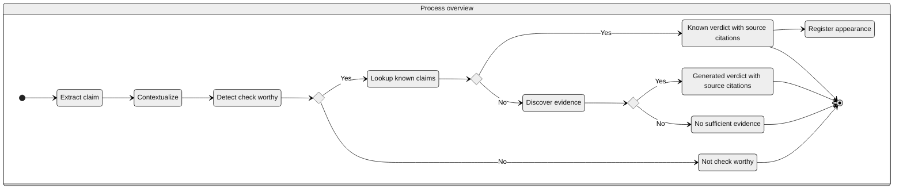
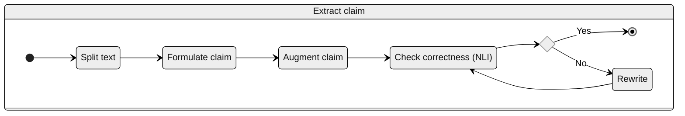
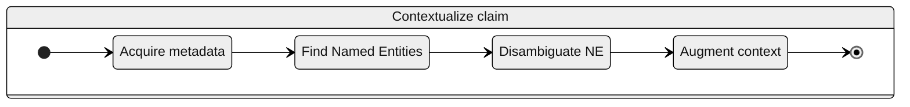
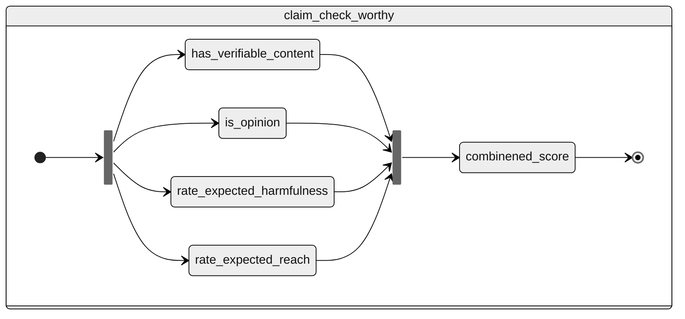
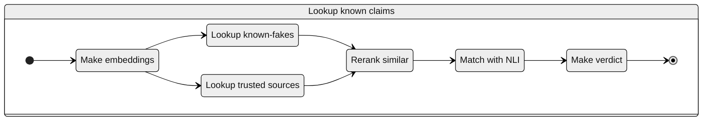
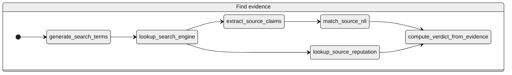

 ## Overview

```mermaid
%%{init: {'theme':'neutral'}}%%
stateDiagram
  direction TB
classDef output font-style:italic,fill:#ffffff
%%%
overview: Process overview
%%%
extract_claim: Extract claim
check_worthy: Detect check worthy
context: Contextualize
known: Lookup known claims
evidence: Discover evidence
appearance: Register appearance
%%%
not_check_worthy:::output: Not check worthy
new_verdict_and_evidence:::output: Generated verdict with source citations
known_verdict_and_reference:::output: Known verdict with source citations
unverifiable:::output: No sufficient evidence 
state overview{
  direction LR
    state is_check_worthy <<choice>>
    state is_known <<choice>>
    state is_evidence <<choice>>
    [*] --> extract_claim
    extract_claim --> context
    context --> check_worthy
    check_worthy --> is_check_worthy
    not_check_worthy --> [*]
    is_check_worthy--> known: Yes
    is_check_worthy--> not_check_worthy: No
    known --> is_known
    is_known --> known_verdict_and_reference: Yes
    known_verdict_and_reference --> appearance
    known_verdict_and_reference --> [*]
    is_known --> evidence: No
    evidence --> is_evidence
    is_evidence --> new_verdict_and_evidence: Yes
    is_evidence --> unverifiable: No
    new_verdict_and_evidence --> [*]
    unverifiable --> [*]
    


}
```
## Extract claim

```mermaid
stateDiagram
  direction TB
%%{init: {'theme':'neutral'}}%%
%%%
claim_extract: Extract claim
%%%
claim_text_split: Split text
claim_paraphrase: Formulate claim
claim_augment: Augment claim
claim_control: Check correctness (NLI)
claim_rewrite: Rewrite
%%%
state claim_extract{
  direction LR
  [*] --> claim_text_split
  claim_text_split --> claim_paraphrase
  claim_paraphrase  --> claim_augment
  claim_augment --> claim_control
  state is_claim_correct <<choice>>
  claim_control --> is_claim_correct
  is_claim_correct --> [*]: Yes
  is_claim_correct --> claim_rewrite: No
  claim_rewrite --> claim_control 

  }
```
## Contextualize claim

```mermaid
stateDiagram
  direction TB
%%{init: {'theme':'neutral'}}%%
%%%
claim_contextualize: Contextualize claim
%%%
claim_metadata: Acquire metadata
claim_ner_find: Find Named Entities
claim_ner_disambiguation: Disambiguate NE
claim_context_augmentation: Augment context
%%%
state claim_contextualize {
  direction LR
  [*] --> claim_metadata
  claim_metadata --> claim_ner_find
  claim_ner_find --> claim_ner_disambiguation
  claim_ner_disambiguation --> claim_context_augmentation
  claim_context_augmentation --> [*]
  }
```

## Detect check worthy claims

```mermaid
stateDiagram
  direction TB
%%{init: {'theme':'neutral'}}%%
state fork <<fork>>
state join <<join>>
state claim_check_worthy{
  direction LR
  [*] --> fork
  fork --> has_verifiable_content
  fork --> is_opinion
  fork --> rate_expected_harmfulness
  fork --> rate_expected_reach
  has_verifiable_content --> join
  is_opinion --> join
  rate_expected_harmfulness --> join
  rate_expected_reach --> join
  join --> combinened_score
  combinened_score --> [*]
}
```
## Lookup known high-quality sources

```mermaid
stateDiagram
  direction TB
%%{init: {'theme':'neutral'}}%%
%%%
sources_find: Lookup known claims
%%%
generate_embeddings: Make embeddings
lookup_fakes: Lookup known-fakes
lookup_trusted: Lookup trusted sources
lookup_rerank: Rerank similar 
match_known_nli: Match with NLI
copy_verdict: Make verdict
state sources_find {
  direction LR
    [*] --> generate_embeddings
    generate_embeddings --> lookup_fakes
    generate_embeddings --> lookup_trusted
    lookup_fakes --> lookup_rerank
    lookup_trusted--> lookup_rerank
    lookup_rerank --> match_known_nli
    match_known_nli --> copy_verdict
    copy_verdict --> [*]
  }
```
## Discover evidence and rate claim

```mermaid
stateDiagram
  direction TB
%%{init: {'theme':'neutral'}}%%
%%% 
evidence_find: Find evidence
%%%
state evidence_find {
  direction LR

    [*] --> generate_search_terms
    generate_search_terms --> lookup_search_engine
    lookup_search_engine --> lookup_source_reputation
    lookup_search_engine --> extract_source_claims
    extract_source_claims --> match_source_nli
    match_source_nli --> compute_verdict_from_evidence
    lookup_source_reputation --> compute_verdict_from_evidence
  }
```